# micro-colorschemes

Micro is a small but modern editor for the Linux console: https://github.com/zyedidia/micro
(Since the program is written in Go, it runs certainly on niche systems where Go is available.)

Micro comes with some color schemes. This is a short overview how the micro colorschemes look. The files were created with a simple shell script [micro-colorschemes.sh](micro-colorschemes.sh)

atom-dark: 
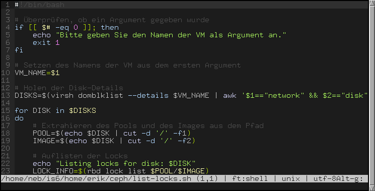

bubblegum:
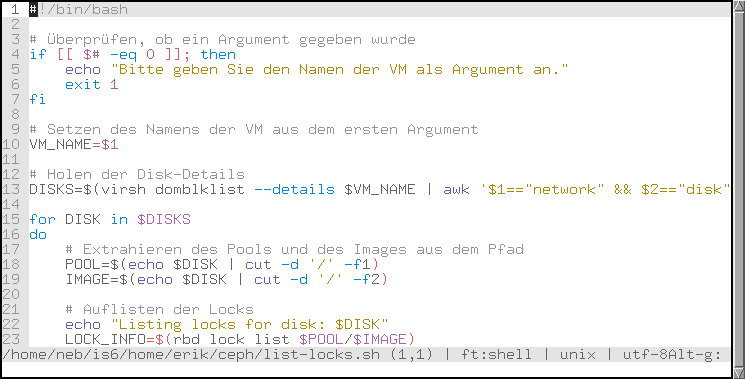

cmc-16:
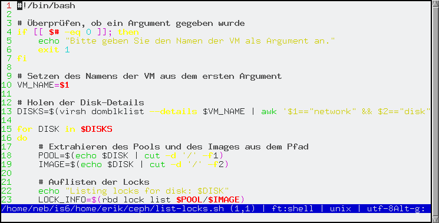

cmc-tc:
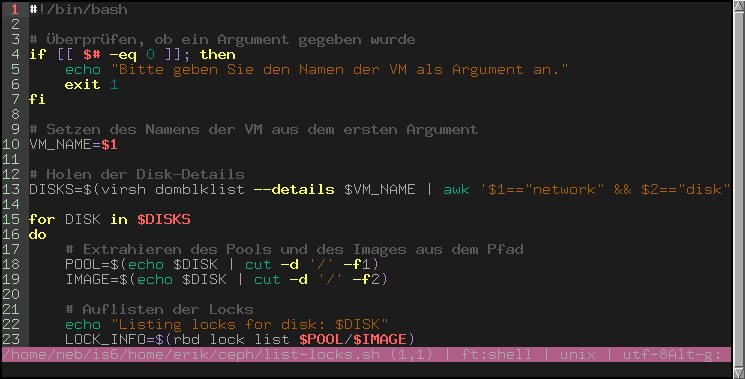

darcula:
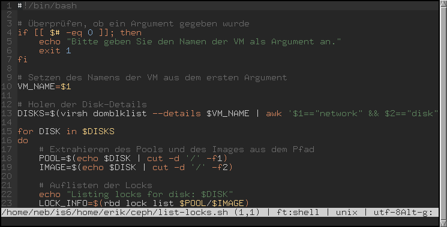

default:

dracula-tc:
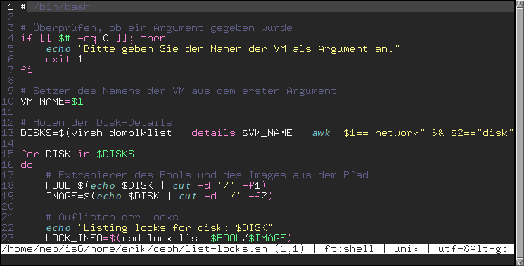

dukedark-tc:
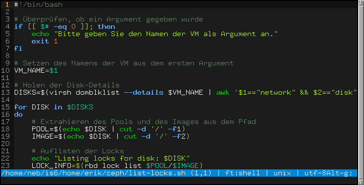

dukelight-tc:
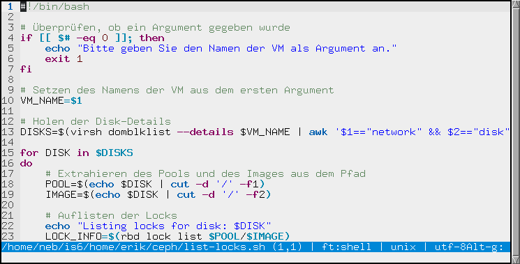

dukeubuntu-tc:
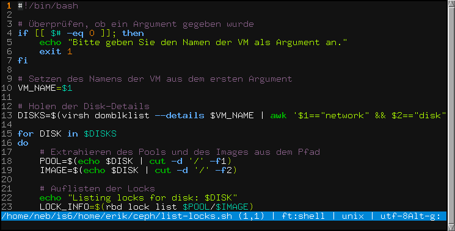

geany:
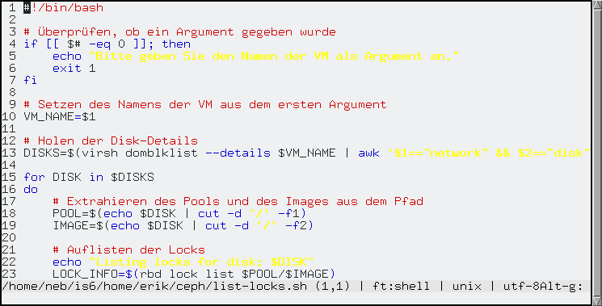

gotham:
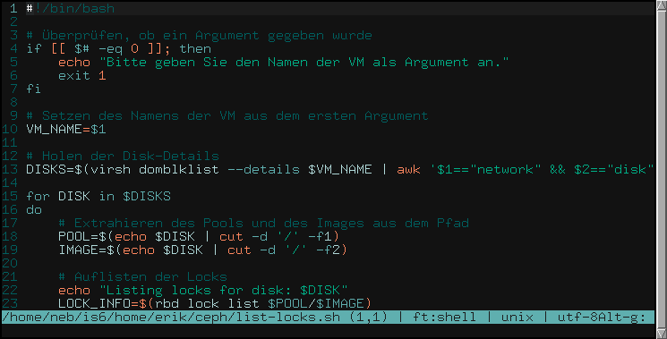

gruvbox:
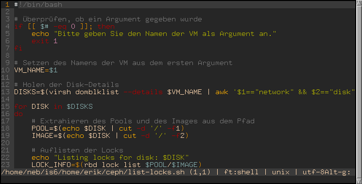

gruvbox-tc:
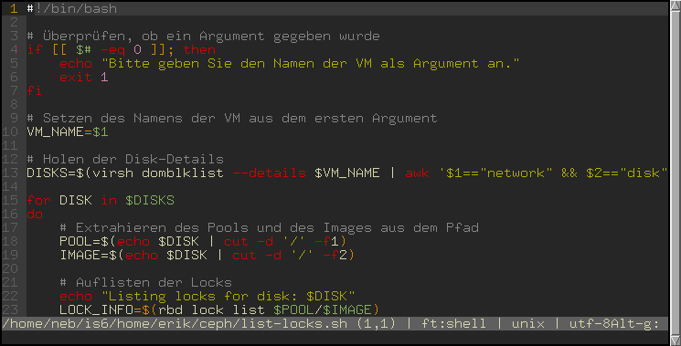

material-tc:
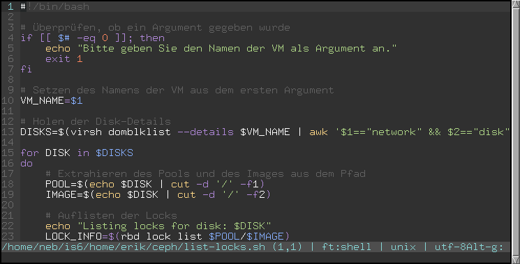

monokai-dark:
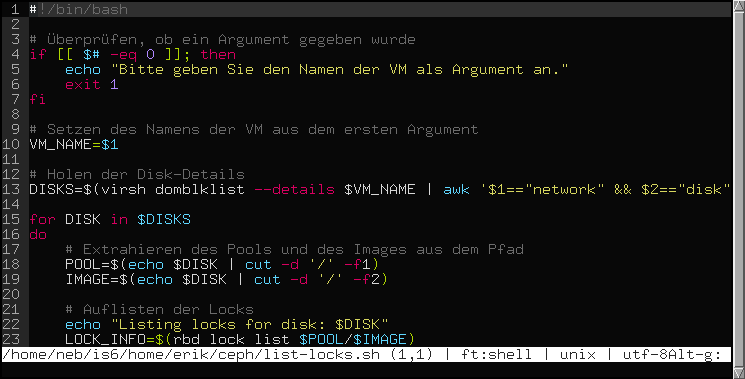

monokai:

one-dark:
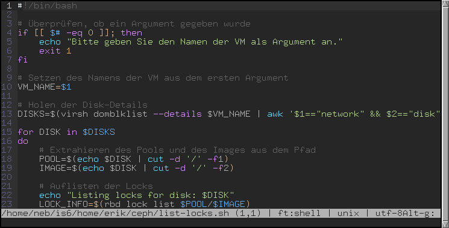

railscast:
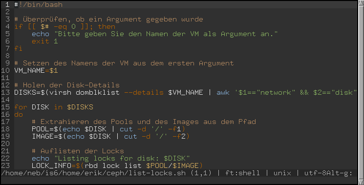

simple:
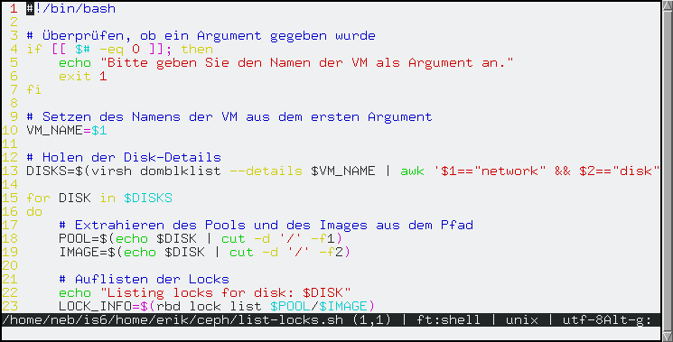

solarized:
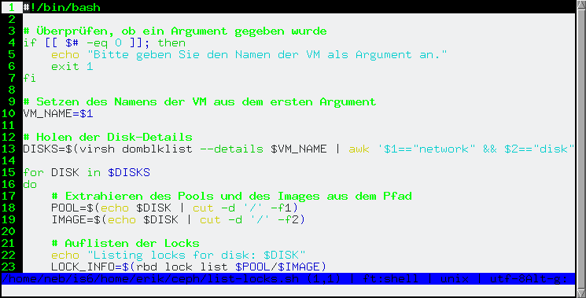

solarized-tc:
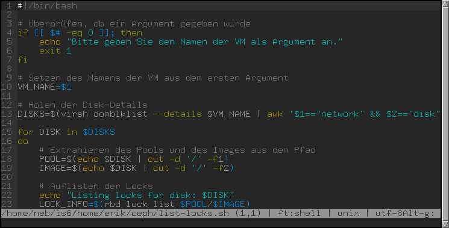

sunny-day:
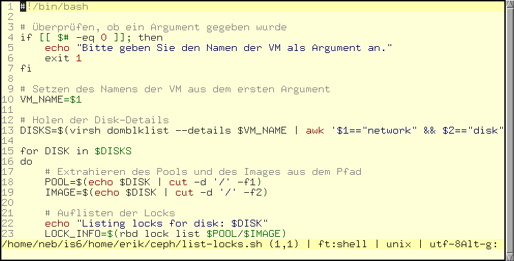

twilight:
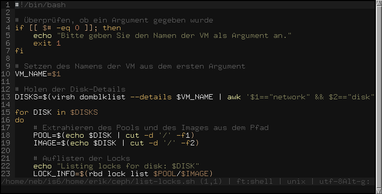

zenburn:
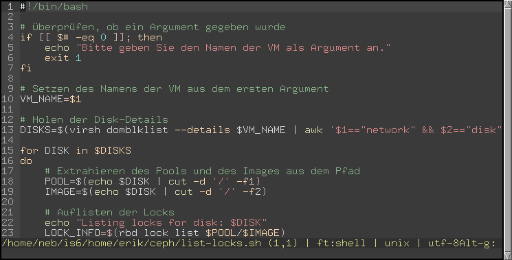
